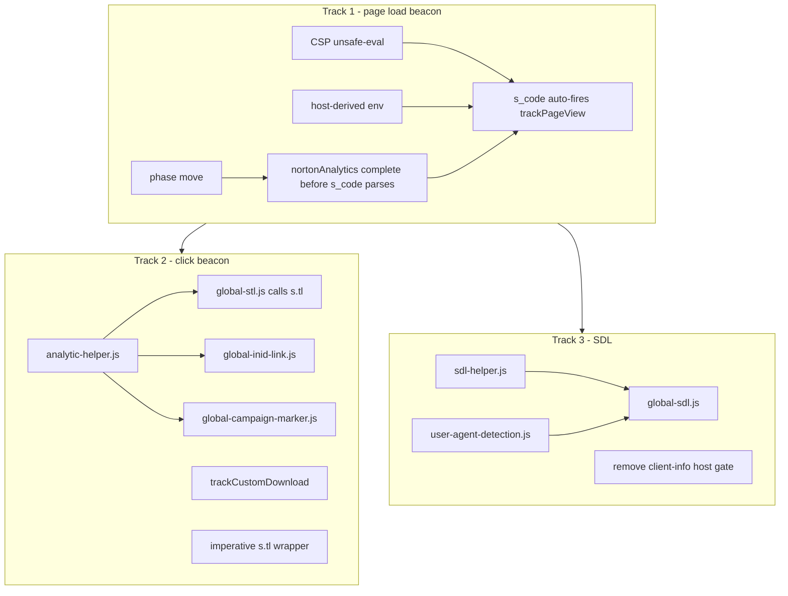
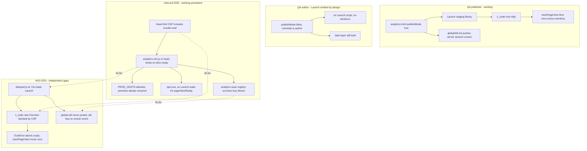

# Adobe Analytics and SDL enablement for AVG EDS

## Why this document exists

Two questions started this work:

1. Why do no Adobe Analytics beacons appear in Omnibug on the QA **author** instance, when they appear correctly on the QA **publisher**?
2. What is required to get Adobe Analytics and the Single Data Layer (SDL) working on the AVG Edge Delivery (EDS) site, at parity with QA publisher?

The answers turned out to be unrelated to each other. The author behaviour is intentional and needs no fix. The EDS behaviour has four independent blockers, one of which is the actual root cause of the empty Omnibug panel.

Everything below was confirmed against live runtime — HTTP headers, console state, and network traces — rather than inferred from reading code. Where a claim rests on a specific observation, the observation is quoted.

### Scope

- **In scope:** Adobe Analytics page-load beacon, Adobe Analytics click/link tracking, and the full SDL event set, all at QA-publisher parity.
- **Out of scope:** Ensighten / CHEQ and consent gating. See [Ensighten and consent](#ensighten-and-consent) for what this excludes and why it is safe.
- **Landed with this document:** Blocker 1 (CSP `'unsafe-eval'`) and Blocker 2 (host-derived analytics bucket). These two must ship together — see [Blocker 2](#blocker-2--test-traffic-points-at-the-production-report-suite) for why.
- **Not yet implemented:** Blockers 3 and 4, and all of Tracks 2 and 3.

### Reference projects

Three codebases, each authoritative for something different:

- **`~/avast2`** — traditional AEM. The only source of truth for the SDL contract: `global-sdl`, `global-stl`, the event taxonomy, and `sdlObj`.
- **`~/lifelock-ue-main`** — a sibling **EDS** project on the same Norton martech stack: same `assets.adobedtm.com` Launch, same `veritasdev` / `symanteccom` accounts, same `s.tl` link tracking. It is *not* an SDL reference — it has no `window.sdl` at all and uses `window.genDL` for Amplitude — but it has already solved every EDS-plumbing problem this project is hitting, in production.
- **`eds-ue-avg-san`** — this project.

LifeLock independently landed three of the fixes proposed below, which turns them from proposals into precedent:

- `'unsafe-eval'` is in its CSP
- analytics loads from `head.html`, not `delayed.js`
- environment is resolved from a hostname allowlist, not the branch name

## What fires where

| Signal | QA author | QA publisher | AVG EDS (today) | LifeLock EDS |
| --- | --- | --- | --- | --- |
| Adobe Launch script | absent (by design) | present, staging library | present, but at `+3s` | present, at `dom.ready` |
| `window.s` (AppMeasurement) | absent | present | present but crippled | present |
| `s.p_gpv` | n/a | `function` | `undefined` | `function` |
| `nortonAnalytics.pagetagfired` | n/a | `true` | `undefined` | n/a (uses `spa`) |
| Page-view beacon `/b/ss/` | none | `oms.norton.com/b/ss/veritasdev/...` | **none** | present |
| `nortonAnalytics` data layer | built | built | built | built |
| `window.sdl` client push | yes | yes | **no** (host-gated) | n/a |
| `window.sdl` server/session/screen | yes | yes | **no** (never ported) | n/a |
| Report suite | n/a | `veritasdev` | **`symanteccom`** (wrong) | host-derived |

The two bolded EDS rows in the middle are the reported symptom. The bolded report suite is a latent problem that becomes active the moment the symptom is fixed.

## Part 1 — QA author: working as designed

**No change is proposed to avast2.** This section exists to explain the behaviour and to redirect verification to publish.

The Launch `<script>` is simply absent from the author HTML. Only the preconnect hints are present:

```html
<link rel="preconnect" href="//assets.adobedtm.com">
```

QA publisher, by contrast, has the real thing:

```html
<script src="//assets.adobedtm.com/b29989a14bed/ccef52b414db/launch-a7750c919e12-staging.min.js"></script>
```

The gate is in `ui.apps/src/main/content/jcr_root/apps/avast/components/page/analytics.html`:

```html
data-sly-test="${analytics.publishMode}"
```

And `publishMode` is set in `AvastAnalytics.postConstruct()`, which returns `true` only when `SlingSettingsService.getRunModes()` contains `publish`.

### Why `wcmmode=disabled` does not help

This is the key misunderstanding worth correcting. `wcmmode=disabled` only drives the `data-author-mode` attribute, which the author page already correctly reports as `"false"`. It has no influence on Sling run modes, and `publishMode` is derived from run modes alone. An author instance is never in the `publish` run mode, so no URL parameter will make Launch appear there.

Without Launch there is no `window.s`, and without `window.s` there is no beacon — which is exactly what Omnibug reports.

The author instance does still build `nortonAnalytics`, `sdlObj`, and `dataLayer`, and it does fetch `client-info.js`. That is why the data layer looks healthy in author while Omnibug stays empty, and it is the detail that makes this failure look like a bug when it is not.

**How to verify instead:** use QA publisher, or use the EDS preview URL once the fixes in Part 2 have landed.

## Part 2 — EDS blockers

Four independent problems. Only the first causes the empty Omnibug panel; the rest are uncovered by fixing it, or affect data quality rather than presence.

### Blocker 1 — CSP is missing `'unsafe-eval'` (the root cause)

The live response header on the EDS page:

```
content-security-policy: script-src 'nonce-...' 'strict-dynamic' 'unsafe-inline' http: https:; base-uri 'self'; object-src 'none';
```

Norton's `s_code_norton_min.js` assigns two functions using the `Function` constructor, at roughly line 2 column 38750:

```js
s.p_gpv = new Function("k", "u", ...);
s.p_gvf = new Function(...);
```

`new Function` is dynamic code evaluation, so without `'unsafe-eval'` it throws `Uncaught EvalError` at top level. That aborts the remainder of the file — and the aborted tail is the statement that fires the page view:

```js
!enableAdobeAnalytics||nortonAnalytics.spa||nortonAnalytics.pagetagfired
  ||nortonAnalytics.disablePVtagfire||(s.trackPageView(nortonAnalytics),nortonAnalytics.pagetagfired=!0);
```

So the beacon is not misconfigured or misrouted. The line of code that would send it never executes.

Side-by-side proof:

- **EDS:** `typeof s.p_gpv === 'undefined'`, `nortonAnalytics.pagetagfired === undefined`, `s.pageName === undefined`, and zero `/b/ss/` requests. The stack trace names `s_code_norton_min.js`, loaded via `loadAdobeLaunch` in `scripts/analytics/vendor-tags.js`.
- **QA publisher:** `typeof s.p_gpv === 'function'`, `pagetagfired === true`, `s.pageName === 'avast.com:us:homepage:homepage'`, and the beacon `oms.norton.com/b/ss/veritasdev/1/JS-2.22.0-LEWM/...` is present. That page carries no CSP meta tag at all, which is why the problem is invisible there.

#### The `sdlHub.trackError` error has the same root cause

The secondary console error `Uncaught TypeError: window.sdlHub.trackError is not a function` is a second symptom of this same CSP gap, but not for the reason it first appears. Verified on the live page:

- `sdlHub` is **not** built by the Norton s_code, and it is not built by our code either. A search for `sdlHub` across both `avast2` and this repo returns nothing — it is constructed entirely inside GTM-WPC6R3K.
- The object exists and carries all eight of its expected keys: `trackError`, `storage`, `getTrackingSettings`, `cookieGet`, `cookieSet`, `eventTransform`, `identifiers`, `lib`.
- But **six of those eight are `undefined`**. Only `identifiers` and `lib` hold objects. Every function member is missing.
- No external SDL library request appears in the network log, so nothing failed to download. The skeleton was created in-page and the step that would populate its methods never completed.
- The console reports the eval violation with **count 2**, and the user-reported stack frames are `sdl_hubInit (<anonymous>:2:327)` — `<anonymous>` being the signature of code created through `eval` or `new Function`.

Read together: there are two separate eval violations, one from the s_code and one from GTM's own hub initialization. GTM builds the `sdlHub` skeleton, an eval-dependent step that would assign its six methods is blocked, and a later tag then calls `sdlHub.trackError(...)` and throws.

So one CSP change should clear both console errors. Because the mechanism is inferred from the partial-object state rather than observed directly inside GTM's sandbox, this remains a re-check in the verification list rather than an assumption.

> **Measurement caveat for anyone re-testing this.** Probing with `new Function('return 1')` through DevTools returns success even on the broken page, because CDP's `Runtime.evaluate` bypasses page CSP. That result is an artifact of the tool, not evidence that eval is allowed. Judge this from the console violation and the partially-populated `sdlHub`, not from an evaluated probe.

**Fix:** add `'unsafe-eval'` to `script-src` in **both** `head.html` and `404.html`. The 404 page carries its own copy of the CSP and loads `scripts.js`, so it reaches `initAnalytics()` too and would otherwise remain broken.

LifeLock already ships exactly this, in both files:

```
script-src 'nonce-aem' 'strict-dynamic' 'unsafe-inline' 'unsafe-eval' https:; base-uri 'self'; object-src 'none';
```

One incidental difference: LifeLock also dropped `http:` from the allowlist. Under `'strict-dynamic'`, host allowlists are ignored for scripts anyway, so that part is cosmetic and not proposed as a separate fix.

Note that our own ported code will need `'unsafe-eval'` too, unless it is rewritten. See [The second eval consumer](#the-second-eval-consumer).

### Blocker 2 — test traffic points at the production report suite

`resolveEnvName()` in `scripts/env.js` splits the hostname on `--` and maps the branch name `main` to `live`. So `main--eds-ue-avg-san--santhoshkumarsrg.aem.live` resolves to:

- `analyticsAccount: 'symanteccom'` (production)
- the production Launch library `launch-773db4767ac4.min.js`
- `analyticsEnvironment: 'prod'`

QA publisher uses `veritasdev`, `launch-a7750c919e12-staging.min.js`, and `dev`.

Confirmed live on `https://main--eds-ue-avg-san--santhoshkumarsrg.aem.live/santhosh-test`:

- `window.nortonAnalytics.account === 'symanteccom'`
- the loaded Launch library is `launch-773db4767ac4.min.js` — the **production** one, not `launch-a7750c919e12-staging.min.js`
- the loaded AppMeasurement is `nortonlifelock.com/content/dam/norton-adobe-analytics/**prod**/s_code_norton_min.js`

The sequencing here matters: this is harmless *only* while Blocker 1 suppresses all beacons. The moment the CSP is fixed, this page starts writing test traffic into production Adobe Analytics under the production report suite. **Blocker 2 must land in the same change as Blocker 1, never after it.** Shipping the CSP fix on its own would convert a silent failure into production data corruption.

**Fix:** switch from branch-derived to host-derived resolution, as LifeLock's `scripts/analytics/env.js` does:

```js
const PROD_HOSTS = ['lifelock.norton.com'];

export function isProductionEnvironment() {
  return PROD_HOSTS.includes(window.location.hostname);
}

function envBucket() {
  return isProductionEnvironment() ? 'prod' : 'nonprod';
}
```

The property worth copying is not the code but its failure mode. Because no `*.aem.page` or `*.aem.live` host is ever in `PROD_HOSTS`, every preview and every branch gets the non-prod bucket automatically. Safety is structural rather than dependent on someone naming a branch correctly.

For AVG: `PROD_HOSTS = ['www.avg.com', 'avg.com']`.

LifeLock also keeps a separate `resolveEnvironment()` returning `prod` / `stage` / `dev` purely as a reporting label, deliberately decoupled from the vendor bucket — stage reports as `stage` but ships dev tags. The same two-function split is recommended here.

### Blocker 3 — SDL is incomplete

Two causes.

First, `canFetchClientInfo()` in `scripts/analytics/sdl.js` restricts the client-info fetch to `*.avg.com`:

```js
export function canFetchClientInfo() {
  if (typeof window === 'undefined') return false;
  const { hostname } = window.location;
  return hostname === 'avg.com' || hostname.endsWith('.avg.com');
}
```

So it never runs on `aem.live`, `aem.page`, or localhost, and the `client` push never happens there.

The gate is over-cautious. avast2 fetches an absolute cross-origin URL from a `norton.com` publisher host and it returns 200:

```html
<script>fetch("https://www.avast.com/client-info.js?fetch=true").then(t => t.text()).then(t => { let e = JSON.parse(t); window.sdl = window.sdl || [], window.sdl.push(e) }).catch(t => { });</script>
```

That is strong evidence the endpoint serves permissive CORS headers. Confirming the response headers is listed as a verification step rather than asserted here.

Second, `ui.frontend/src/main/webpack/theme/js/global-sdl/index.js` was never ported, so nothing pushes `server`, `session`, or `screen`. See [Track 3](#track-3--sdl-event-set).

Confirmed live: `window.sdl` has length 3, and its entries are `gtm.js`, `gtm.dom`, `gtm.load` — **GTM's own lifecycle events and nothing else**. No `client`, no `server`, no `session`, no `screen`. There is also no `client-info.js` request in the network log, consistent with the host gate. Meanwhile `window.sdlObj` *is* built correctly:

```json
{"pageType":"","lineOfBusiness":"consumer","screenId":"77b6b63b-...","screen":{"name":"en-ww | en-ww/santhosh-test"}}
```

So the page assembles the payload and then never pushes it. Note also that `pageType` is an empty string, which is a separate data-quality gap to resolve while porting.

### Blocker 4 — analytics runs in the delayed phase

`initAnalytics()` is called from `scripts/delayed.js`, which `loadDelayed()` schedules as:

```js
window.setTimeout(() => import('./delayed.js'), 3000);
```

Launch therefore initializes well after `DOMContentLoaded` and `load`, so container rules bound to those events never fire — including the one `domReady` rule actually present in the AVG container, "Adobe: Trustpilot: Clicked". avast2 emits all of this in `<head>` with Launch `async`.

LifeLock hit and fixed this same problem; its `scripts/delayed.js.md` records analytics being moved out of the delayed phase into the head under WEBEXP-109839. The shape is a head-loaded module that boots on `dom.ready`:

```html
<script nonce="aem" src="/scripts/analytics/analytics.min.js" type="module"></script>
```

```js
dom.ready(() => {
  initAnalytics();
  installScanListener();
  installGlobalHandlers();
  scan(document);
});
```

**But do not copy this wholesale.** LifeLock pays for head-loading with a build step: `tools/build-analytics.mjs` bundles roughly 28 ES modules into a 36 KB `analytics.min.js` via esbuild, with `npm run build:analytics:check` guarding staleness in CI. AVG's `AGENTS.md` states "no build steps", so head-loading ten unbundled modules would cost a waterfall of round trips.

Two honest options:

1. Adopt a small esbuild bundle for the analytics stack only, following LifeLock's precedent.
2. Keep modules unbundled and move analytics to the **lazy** phase rather than the head — still before `load`, still ahead of the delayed timer, and no build step.

**Recommended: option 2 first**, because it is reversible and blocks nothing else.

This item also has significant performance consequences, and should be read together with [Part 4](#part-4--performance-and-lighthouse). In particular, the phase move should be **split** so that only the small data layer moves early while the expensive vendor tags stay tunable.

## Part 3 — The three parity tracks

"Adobe Analytics" is not one thing. In avast2 the page-load beacon and the click beacon are separate code paths with separate dependencies, and the SDL is a third concern again. Treating them as one is how the click stack got overlooked in early drafts of this analysis.



Track 1 comes first because both other tracks depend on `window.s` existing and on `nortonAnalytics` being populated.

### Track 1 — page-load beacon

Covered by Blockers 1, 2, and 4 above, plus one ordering constraint worth stating separately: `nortonAnalytics` must be **complete before the s_code parses**, because the s_code latches `enableAdobeAnalytics = false` permanently if it is missing. That is what makes the phase move and the SDL port interdependent rather than independent workstreams.

#### How the page view fires — decision

There are two valid architectures. The AVG Launch container currently supports only one of them. Enumerated at runtime, the container has 4 extensions (`adobe-analytics`, `adobe-mcid`, `adobe-target`, `core`) and just **2 rules**: "Adobe: Trustpilot: Clicked" (`domReady`) and "Adobe Target" (`libraryLoaded`). There is no Direct Call rule.

- **Option A — s_code auto-fire (avast2 parity, no martech dependency).** Leave `nortonAnalytics.spa` unset and let the tail of `s_code_norton_min.js` call `s.trackPageView(nortonAnalytics)` itself. This is what QA publisher does. It needs nothing from the Launch team beyond the CSP fix.
- **Option B — `spa: true` plus a `pageViewReady` Direct Call (LifeLock pattern).** LifeLock's `vendors-aa.js` documents the mechanism in a comment that independently confirms the `spa` gate found in the s_code tail:

```js
// EDS fires the PageView on the app-emitted `pageViewReady` event instead (DOM + data ready).
spa: true,
```

**Decision: Option A.** Two consequences follow:

- `nortonAnalytics.spa` stays unset. The s_code's own gate then permits the auto-fire, so no `_satellite.track('pageViewReady')` call and no Launch property change are needed.
- The beacon fires **synchronously** as the s_code finishes parsing. Everything it depends on must already be in place when Launch loads. This promotes the phase move and the client-before-screen sequencing from improvements to **prerequisites** — under Option B a late-arriving data layer would merely delay the beacon, but under Option A it ships an incomplete one.

Option B is retained as a documented fallback if the synchronous-fire constraint later proves too tight for EDS.

### Track 2 — click beacon

Four modules under `theme/js/analytic/` make clicks work in avast2:

- **`analytic-helper.js`** — port of `analytic/helper.js`. Shared dependency of everything below: `createTemplateParse`, `getUrlInfo`, `getLinkType`, `LINK_TYPE`.
- **`global-stl.js`** — AA link tracking via `s.tl` with `linkTrackVars = 'prop41,eVar41'`, driven by `[data-template-stl]` and `[data-custom-template-stl]`. **`prop41 = 'avg.com'`** for this brand. LifeLock's `aa-track.js` is the same shape with `prop41 = 'lifelock'` where avast2 uses `'avast.com'`, confirming the pattern survives the EDS port unchanged.
- **`global-inid-link.js`** — compiles `[data-template-inid]` into `data-inid`, then branches on link type. Internal and `tel:` links persist the inid to `localStorage` on click; external links get `?inid=` appended to the href; same-page anchors dispatch `global::stl::inid-anchor-link::click`.
- **`global-campaign-marker.js`** — expands `[data-campaign-marker]` placeholders into the `XXX~ll-cc~yyyyy~abTest~testVersion~trSrc` marker and sets `campaignMarker` (or `x-campaignMarker` for SMB) on cart links. Site code **`WDS`**, with avast2's `SMBW-WDS` retained for the SMB branch since that is selected by product category rather than brand.

Plus download tracking: `trackCustomDownload(link, downloadId, '')`, called from `free-download-critical.js` alongside the SDL push, is the AA-side download beacon and needs an EDS home.

`global-inid-link.js` deserves particular attention because it closes an existing loop. The EDS `norton-analytics.js` already **reads** `localStorage.inid`, but nothing in the EDS codebase ever writes it — so that value is permanently empty today. Porting this module is what makes the existing read meaningful.

#### The second eval consumer

`createTemplateParse` compiles the inid and stl templates with the `Function` constructor:

```js
return (stringTemplate, additionalData) => Function(`params`, "return `"
  + stringTemplate.replace(paramNameRegex, "${params.$1 || ''}$2")
  + "`;")(Object.assign(data, additionalData));
```

This matters because `'unsafe-eval'` is then required not only for a third-party file outside our control, but for our own ported code.

**Recommendation:** rewrite `createTemplateParse` as a plain regex substitution against the data object — a small, behaviour-preserving change — and keep the CSP exception scoped to the s_code alone. That leaves exactly one justified reason for the exception instead of two, and it is the only way this module could ever run under a stricter CSP.

#### The imperative escape hatch

A sweep of every `s.tl` call site in avast2 turned up a second click-tracking pattern that the declarative path does not cover. `components/powerreviews/_powerreviews.js` calls the beacon directly:

```js
s.linkTrackVars = "prop41,eVar41";
s.tl(true, "o", eventName);
```

This matters as a **pattern**, not as one component. The `global-stl` path only works for `<a>` elements carrying a template attribute, so any block needing to track a non-anchor interaction — a widget filter, a pagination control, a carousel advance — has no declarative route. AVG EDS has no reviews block today, so nothing is currently broken, but a small supported wrapper should be exposed rather than leaving each future block to rediscover the `linkTrackVars` incantation and get the `s.tl(true, "o", name)` argument order wrong.

### Track 3 — SDL event set

Proposed layout under `scripts/analytics/`, mirroring avast2 module boundaries so future diffs stay readable:

- **`sdl-helper.js`** — port of `global-sdl/helper.js`: `getAttributeValueAsStr`, `getAttributeValueAsNumber`, `removeUnwantedParamsFromLink`, `REF_VALUES`
- **`user-agent-detection.js`** — the `os` / `browser` / `platform` subset of `theme/js/user-agent-detection.js` that global-sdl needs. LifeLock has no equivalent (its `getOS()` in `scripts/critical.js` is download-UI only, not analytics), so this is a genuine new port with no EDS precedent.
- **`global-sdl.js`** — the page-load and interaction pushes
- **`sdl.js`** — drop the `canFetchClientInfo()` host gate so the `client` push happens everywhere

#### Complete event inventory

Verified by sweeping every `sdl.push` call site in avast2, not just `global-sdl/index.js`. **Fourteen** pushes total.

Page load:

1. `client` — from the client-info fetch
2. `server` + `session`
3. `screen`

Interaction:

4. `user.buy.products` — cart-link clicks
5. `user.click.link` — generic link clicks
6. `user.download.media` — `data-role="media"` clicks
7. `user.send.form` — form submits
8. `system.modal` — modal open/close
9. `system.error` — form and runtime errors
10. `user.read.article` — hero below-fold scroll trigger
11. `user.hover.element` — hover intent
12. `user.click.element` — fired by `onUserCloseModal` with `actionType: 'close'`, `component`, `path`, `id`
13. **A second `screen` push on modal open** — avast2 re-pushes `screen` when a standard modal opens so the modal counts as a virtual page view. Without it, modal traffic is invisible.
14. `user.download.products` — pushed by `free-download-critical.js` with a fully populated product object (`sku`, `category`, `offerType: "download"`, `link_position`, plus hardcoded `maintenance: 0`, `seats: 1`, `quantity: 1`, `currencyCode: "USD"`, `price: 0`, `brand: "Avast"`)

Items 12 to 14 were missed in early drafts of this analysis and are the most likely to be overlooked again, because none of them is reachable by reading `global-sdl/index.js` top to bottom.

#### Wiring order

`initSdl` must run **before** `loadVendorTags()` in `scripts/analytics/index.js`, because the s_code reads `nortonAnalytics` synchronously and permanently sets `enableAdobeAnalytics = false` if it is missing. `globalSdl.init()` must run after the data layer exists, matching avast2's `defer.js` `onDomLoad` ordering.

### The client-before-screen requirement

GTM-WPC6R3K requires the `client` push to land before `screen`. This is a hard requirement, not an incidental ordering, and the current EDS implementation cannot guarantee it.

avast2 satisfies the ordering by accident of timing. Its client-info fetch is fire-and-forget, but it is the **first script in the analytics block**, at the top of the document, while the `screen` push happens much later from `global-sdl` on DOM load. The fetch gets an entire page parse of head start and wins the race in practice.

The EDS port copied the fire-and-forget shape without the head start — `initSdl` calls `fetchClientInfo()` and does not await it:

```js
export default function initSdl(ctx) {
  window.sdl = window.sdl || [];
  window.sdlObj = buildSdlObj(ctx);
  fetchClientInfo();
}
```

Moving analytics earlier (Blocker 4) **tightens** this race rather than relaxing it, because the fetch starts far later relative to the `screen` push. Relying on timing would make the ordering flaky.

Required sequencing:

- Kick the client-info fetch off as early as possible so it is likely already resolved before anything else runs.
- Chain the `screen` push off the client-info promise rather than firing it independently.
- Put a **short timeout** on that wait, so a slow or failed fetch degrades to a `screen` push without `client` instead of suppressing the page view entirely. Losing one dimension is recoverable; losing the page view is not.

### The lazy-decoration problem

This applies to Tracks 2 and 3 equally and it changes the port design rather than merely endorsing it.

avast2's `global-sdl.init()` and `global-stl.init()` do **static** `document.querySelectorAll` at init time — `heroSelector()` for the below-fold trigger, `[data-template-stl]` for link tracking. That works in traditional AEM because the server ships the whole DOM. It does **not** work in EDS, where blocks decorate in the lazy phase, after analytics has booted. A straight port would silently find nothing.

LifeLock's `boot.js` documents the failure mode explicitly:

```
/* Safety-net full sweep after the page finishes loading. dom.ready fires on
 * DOMContentLoaded - BEFORE EDS decorates its blocks - so the initial
 * scan(document) above sees nothing, and per-block `analytics:scan` dispatches
 * are the primary wiring path. ... */
```

Their answer is a marker and rescan registry in `scripts/analytics/wire.js`: blocks stamp `data-analytic="<name>:0"` on their root and dispatch a bubbling `analytics:scan` CustomEvent at the end of decoration. `scan()` resolves the marker to a handler, mounts it, and flips the marker to `:1` so rescans are idempotent, with a `window.load` safety sweep for blocks that dispatch before being connected to the document.

One subtlety worth inheriting rather than rediscovering: `scan()` must also test the scope element itself, since a block stamps the marker on its own root and `querySelectorAll` only matches descendants. LifeLock handles this with `if (scope.matches?.(PENDING_SELECTOR)) pending.unshift(scope);`.

**However, avast2 already has its own rescan convention**, so this is not purely a LifeLock import. `global-inid-link.js` and `global-stl.js` both listen for a setup event and re-run template compilation over just the dispatching subtree:

```js
document.addEventListener('global::inid::setup', (e) => {
  const {templateType, overrideData} = e?.detail || {};
  if (templateType && templateType in templateTypeFnMap) {
    templateTypeFnMap[templateType](e.target, overrideData);
  }
});
```

The `:not([data-inid])` and `:not([data-stl])` guards in the selectors make these dispatches idempotent, exactly like LifeLock's `:0` to `:1` marker flip. So the port should split three ways:

- **Link tracking (inid, stl, campaign marker):** reuse the existing `global::inid::setup` and `global::stl::setup` event names, dispatched by EDS blocks at the end of `decorate`. This keeps AVG blocks speaking the vocabulary the rest of avast2 already speaks, and requires no new machinery for the largest chunk of the work.
- **SDL-only handlers:** add a LifeLock-style `data-sdl="<name>:0"` marker registry, because `onBelowFold` (hero geometry) and `system.modal` wiring need a named handler mounted per block, which the setup-event pattern does not express.
- **The delegated document-level `click` handler:** ports as-is and needs neither mechanism, since delegation is inherently late-binding.

### Block instrumentation

A repo-wide search for `data-role`, `data-sdl`, `data-popup-open`, `data-btn-location`, `data-campaign-marker`, and `data-product-id` across `blocks/` returns nothing today. All of it is new.

The complete `data-role` vocabulary in avast2 is five values — `cart-link`, `download-link`, `cta-link`, `promo-link`, `media` — and that closed set is the contract:

- `data-role="cart-link"` plus `data-product-id`, `data-price`, `data-campaign`, `data-campaign-marker`, `data-product-category`, `data-btn-location` on buy anchors. `blocks/pricing/pricing.js` already sets `dataset.sku` and `dataset.campaign` and builds a `.pricing-buy` anchor, so this is an extension rather than a rewrite.
- `data-role="cta-link"` / `data-role="promo-link"` on CTAs in `hero`, `product-hero`, `promo`, `icon-button`, `media-text`
- `data-role="download-link"` on download buttons, plus `data-product-category` for the `user.download.products` push
- `data-role="media"` on video and media players for `user.download.media`
- A `.c-hero` / `.c-centerhero` equivalent for the `user.read.article` below-fold trigger, remapped to the EDS `hero` block class
- `data-popup-open` / `data-modal-identifier` / `data-cmp-name` for `system.modal` and the modal `screen` re-push. EDS has no modal block yet.

Click tracking adds a second, independent set of attributes on the same anchors:

- `data-template-stl` / `data-custom-template-stl` — compiled into `data-stl`, the `prop41` / `eVar41` payload
- `data-template-inid` / `data-custom-template-inid` — compiled into `data-inid`
- `data-campaign-marker` — placeholder consumed by `global-campaign-marker.js`

Templates use the `≤token≥` delimiter and resolve against `window.nortonAnalytics` merged with `getUrlInfo(href)`, giving `≤destinationPageName≥`, `≤subdomain≥`, `≤anchorName≥`, and every `nortonAnalytics` key.

**These strings are set in block code, not authored.** Verified against avast2: no dialog XML anywhere in `ui.apps` declares `templateStl` or `templateInid`. They are hardcoded in component HTL, for example in `button/templates/basic.html`:

```html
data-template-stl="${isATag && enableStlCall ? stlElem : '' }"
data-template-inid="${isATag && linkTypeForTracking ? linkTypeForTracking : ''}"
```

So no `_{blockname}.json` model changes are needed for any of the three attribute families above — no UE dialog work, no author training, and the token strings stay reviewable in code.

**Scale calibration:** LifeLock instruments 15 blocks this way (`top-nav`, `home-hero`, `product-tile`, `pdes`, `comparison-chart`, `faq`, `accordion`, `footer`, and others), each adding two lines at the end of its `decorate` — a stamp and a dispatch. That is the realistic size of the AVG task across its 17 blocks.

## Part 4 — Performance and Lighthouse

This change affects performance, and `AGENTS.md` targets a PageSpeed score of 100. One change carries real risk, several carry none, and the risk is tunable.

### What carries no risk

Every vendor script is **already** injected `async`, so nothing new becomes render-blocking: `scripts/analytics/vendor-tags.js` uses `loadScript(src, { async: '' })` for Launch and `j.async = true` for GTM. The CSP change is a meta-tag edit with zero runtime cost. Block instrumentation is a handful of `setAttribute` calls inside existing `decorate` functions. The delegated document-level click handler is a single listener regardless of page size, which is cheaper than per-element binding.

### What carries real risk: the phase move

Today Launch, AppMeasurement, and both GTM containers start at `+3s`. Moving them earlier pulls that work inside the window Lighthouse measures.

- **Total Blocking Time is 30% of the Lighthouse performance score** — the heaviest single weight, ahead of LCP (25%) and CLS (25%). Launch plus AppMeasurement plus two GTM containers is a substantial block of main-thread script evaluation. At `+3s` much of it lands outside the measurement window; earlier, it lands squarely inside. This is where a 100 would degrade.
- **LCP via bandwidth contention.** Lighthouse throttles to simulated Slow 4G, so several hundred KB of martech downloading concurrently with the LCP image competes for bandwidth even though the scripts are `async` and parser-unblocking.
- Diagnostics will begin reporting "Minimize third-party usage", "Reduce unused JavaScript", and "Avoid long main-thread tasks". These are unweighted and do not change the score, but they should be expected rather than treated as regressions.

### How early do the vendor tags actually need to be?

Worth stating precisely, because it is easy to over-move them. Under Option A the s_code auto-fires as it finishes parsing and does **not** wait on `DOMContentLoaded` or `load`, so the page-view beacon itself would still fire at `+3s`. Two real reasons remain to move earlier, and both concern data completeness rather than the beacon working at all:

- traffic that bounces before `+3s` loses its page view entirely
- the container's one `domReady` rule ("Adobe: Trustpilot: Clicked") never fires if Launch initializes after `load`

So the vendor-tag phase is a **data-completeness versus Lighthouse tradeoff with a dial**, not a binary. The lazy phase, a shorter delay than 3000 ms, and `requestIdleCallback` with a timeout are all legitimate settings.

### Mitigations, ordered by leverage

The first is not optional.

**1. Target pre-hiding must never move to an early phase.** This is the single largest hazard and it is easy to miss because it is currently latent. `scripts/analytics/vendor-tags.js` injects:

```js
const css = 'body {opacity: 0 !important}';
const timeoutMs = 3000;
```

`injectTargetPrehiding()` is called from `loadVendorTags()`, so it moves with whatever phase the vendor tags move to. Hiding the entire body for up to three seconds means nothing paints, so LCP and FCP become the moment the style is removed — a guaranteed collapse of the score on any page where it is active, however well everything else is tuned.

It is gated on page metadata `enable-adobe-target-prehiding`, so moving vendor tags earlier is only safe while that flag is off. Turning it on requires the Target team's standard pre-hiding tuning and is not an author-level toggle.

> **Separate bug report.** At `+3s` today, this snippet would hide a page that has *already painted* — the opposite of what pre-hiding is for. Pre-hiding only makes sense in the head, before first paint. This is worth raising with the Target and Launch owners independently of this work.

**2. Move the data layer early, leave the vendor tags late.** The phase move should be split rather than atomic. The data layer — `nortonAnalytics`, `window.sdl`, `sdlObj`, the client-info fetch — is a few KB of first-party code, and it is the only part Option A's synchronous fire and the client-before-screen ordering actually require early. Launch, AppMeasurement, and both GTM containers are effectively all of the cost. Splitting them buys the correctness fixes at almost no metric cost.

**3. Shrink the payload instead of only rescheduling it.** Rescheduling moves cost around; shrinking removes it. Two concrete asks, both grounded in what is actually configured:

- The AVG Launch container has **4 extensions but only 2 rules**. `adobe-target` is among the most expensive extensions to ship, and the only Target rule is a `libraryLoaded` one. If Target is not actively used on AVG EDS, asking the Launch team to drop the extension shrinks the library materially — a bigger TBT win than any scheduling change, and it costs us no code.
- There are **two** GTM containers: `GTM-PZ48F8` for `dataLayer` and `GTM-WPC6R3K` for `sdl`. Both are required, but it is worth asking whether the SDL container's tags could be consolidated, since two downloads and two bootstraps is a doubled fixed cost.

**4. Bind interaction tracking late.** The Lighthouse performance run never clicks, hovers, or submits anything, so no click-tracking code path executes during measurement. The entire Track 2 click stack and most of Track 3's interaction handlers can initialize in the delayed phase at **zero** score impact. This is a real optimization rather than a measurement trick — it also matches real behaviour, since nobody clicks in the first few hundred milliseconds. The one constraint: attach the document-level delegated listener early (it is a single cheap listener) even if the handler logic loads lazily, so a fast first click is not dropped.

**5. Keep the early module to a single file.** AVG has no build step, so loading ten unbundled ES modules early costs a request waterfall. Since only the small data-layer piece needs to be early, write that piece as one self-contained file. That sidesteps both the waterfall and the esbuild dependency LifeLock had to take on, and leaves the rest of the stack as normal lazy modules.

**6. Add resource hints.** `head.html` currently has none. A `preconnect` to `assets.adobedtm.com` and a `dns-prefetch` for `www.googletagmanager.com` remove connection setup from the critical path for the largest third-party fetches. Keep the list short — preconnecting to many origins competes for bandwidth and Lighthouse flags it.

**7. Do the template compilation at idle.** Resolving `data-template-stl` and `data-template-inid` across every anchor is DOM work that scales with link count, and on a link-heavy page it could register as a long task. Schedule it via `requestIdleCallback` with a timeout fallback rather than running it inline during block decoration. The external-link href rewrite must complete before a user clicks, which idle scheduling satisfies comfortably.

**8. What not to do.** It is common to exclude martech from lab runs by detecting the Lighthouse user agent. This is explicitly ruled out: it produces a score that does not describe what users experience, and it would hide exactly the regression this section exists to catch. Every mitigation above is a real reduction in work rather than measurement avoidance.

**Bonus from an existing decision.** Deferring Ensighten removes the consent-modal layout shift that is usually the largest CLS contributor on a martech-heavy page. Since CLS is 25% of the score, the Ensighten decision is quietly protecting a quarter of it — worth recording so nobody reverses it without knowing the cost.

### Process

Numbers, not predictions. `AGENTS.md` already requires a PageSpeed Insights run against the feature-preview URL, so require a **before/after run on the same path**, with the TBT delta as the gate and the vendor-tag phase as the thing to tune if it regresses.

LifeLock is the useful reference point: a production EDS site running a comparable analytics stack loaded at `dom.ready`, which establishes that a full martech load in this phase is achievable rather than theoretical.

## Part 5 — Verification

### Fixtures

LifeLock keeps hand-driven analytics fixtures under `test/fixtures/analytics/` (`default.html`, `inid-links.html`, `pdes-aa.html`, and others) served via `aem up --html-folder`, with `test/*` in `.hlxignore` so they never publish. AVG already has a `drafts/` folder and `--html-folder drafts` documented in `AGENTS.md`, so equivalent SDL fixtures belong there.

### Page load

- `typeof window.s.p_gpv === 'function'` — proves the s_code ran to completion
- `window.nortonAnalytics.pagetagfired === true`
- a request to `oms.norton.com/b/ss/veritasdev/...` — note **veritasdev**, not `symanteccom`, once the env fix lands
- the `window.sdlHub.trackError is not a function` error is gone
- Omnibug shows exactly **one** Adobe Analytics page view, with `pageName` matching `sdlObj.screen.name`

### Click

- every tracked anchor has a resolved `data-stl` and `data-inid`, with no leftover `≤token≥` text
- clicking one fires a second `b/ss` beacon with `pe=lnk_o`, `prop41=avg.com`, and `eVar41` populated
- an internal-link click leaves `localStorage.inid` set, and the next page's `nortonAnalytics.inid` picks it up
- an external link's href carries `?inid=`, and a cart link carries `campaignMarker`

### SDL

- `window.sdl` contains `client`, `server` + `session`, and `screen`, in that order. Assert the index of `client` is below that of `screen` **on a throttled connection**, not just on a warm local run, since this is the ordering GTM-WPC6R3K depends on.
- with client-info forced to fail (blocked in devtools), `screen` still pushes after the timeout rather than being suppressed
- each of the eleven interaction events fires once per gesture, with `user.click.element`, the modal `screen` re-push, and `user.download.products` specifically exercised since they are the most recently added
- no event fires twice after a rescan, confirming the marker and `:not([data-stl])` idempotence guards hold
- the client-info response carries permissive CORS headers from a non-`avg.com` origin (confirms Blocker 3's assumption)

### GTM

Needs standalone verification, because QA publisher runs with `WEBAVAST-7241` off and does not load GTM at all — it cannot serve as the reference here.

- both containers load and GTM-WPC6R3K's tags fire without console errors
- `window.sdlHub` is fully populated, specifically that `sdlHub.trackError` is callable. This was the original reported symptom and it is a GTM-side consumer, so it is the clearest single signal that the SDL contract is being met.

### Performance

- before/after PageSpeed Insights on the same feature-preview path
- TBT delta is the gate
- confirm `enable-adobe-target-prehiding` is off on every page used for measurement

## Resolved decisions

Recorded with rationale so the values are traceable rather than looking arbitrary in a later review.

- **Report suite: `veritasdev`** for non-prod EDS, matching QA publisher rather than a dedicated EDS suite. This makes the env-mapping fix a correctness requirement, not a nice-to-have.
- **GTM stays.** Both containers behind `WEBAVAST-7241` are required for AVG on EDS, even though QA publisher does not load them. GTM therefore cannot be validated by comparison against QA publisher and needs its own verification.
- **`client` must land before `screen`** — a hard requirement of GTM-WPC6R3K, not an incidental ordering.
- **`prop41 = 'avg.com'`** for the `s.tl` link-tracking beacon.
- **Campaign-marker site code `WDS`**, with `SMBW-WDS` and the `x-campaignMarker` parameter retained for the SMB branch.
- **Template tokens are not authorable** — set in block code, no UE model changes.
- **Page view via Option A**, s_code auto-fire, with `nortonAnalytics.spa` unset.

### Ensighten and consent

Ensighten / CHEQ is not being enabled. Two consequences, stated explicitly so neither is later mistaken for a bug:

`global-tracking-disabled.js` is **not ported**. Its only job is appending a `trackingDisabled` consent string to `a[data-role="cart-link"]` hrefs, and its `getCHEQCookieConsentStatus()` already returns the safe default when Ensighten is absent:

```js
if (typeof Bootstrapper === 'undefined' || !Bootstrapper?.gateway?.getConsentStatus) {
  return "marketing:0,performance:0,preference:0";
}
```

Porting it today would only ever emit the all-zero string. Deferred until Ensighten lands.

No consent gating sits in front of the AA beacon or the SDL pushes. Everything fires unconditionally, which matches what QA publisher does when the Ensighten flag is off.

## Open items

- **Optional:** whether the Launch owners add a `pageViewReady` Direct Call rule to the AVG property, enabling Option B as a future upgrade if the synchronous-fire constraint proves too tight. Not blocking.
- **Ask:** can the `adobe-target` extension be dropped from the AVG Launch container? See mitigation 3.
- **Ask:** can the GTM-WPC6R3K tags be consolidated into a single container? See mitigation 3.
- **Bug report:** the Target pre-hiding snippet hides an already-painted page at `+3s`. See mitigation 1.

## Reference: environment and state comparison



Note that AVG deliberately diverges from the LifeLock precedent at `L4`: LifeLock uses `spa: true` with a `pageViewReady` Direct Call, while AVG has chosen Option A (s_code auto-fire) for avast2 parity.
