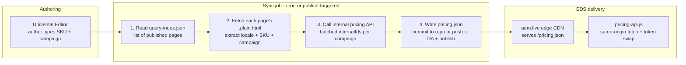

# Pricing on EDS — JSON with crawl discovery

Design note for serving product prices on this Edge Delivery (EDS) site without
each visitor calling the internal pricing API.

## Problem

Prices change infrequently (roughly once per campaign) but the current
implementation ([scripts/pricing-api.js](../scripts/pricing-api.js)) calls
`https://pricing-api.svc.int.avast.com` from every visitor's browser. That
service is internal-only, needs CORS to be exposed publicly, and the per-visitor
call pattern is the worst possible cache-hit ratio for slow-changing data.

Traditional AEM (pluto) already solved this by treating content as the cache: a
scheduler calls the pricing API, writes the results into JCR properties
(`dnt_salePrice`, `dnt_buylink`, `dnt_fetchPrice: false`, ...), and replicates
the node. End users read pre-baked content, never the API. This note translates
that same philosophy onto EDS-native primitives.

## Approach: sync once, serve as edge-cached JSON

A scheduled job discovers which SKUs the site actually uses (by crawling its own
published pages), fetches prices for exactly those SKUs, and publishes the result
as a JSON file that EDS serves. The browser then does a **same-origin** fetch —
no CORS, no internal-API exposure, edge-cached like any other content.



## Pipeline steps

1. **Page discovery via query-index.** EDS maintains `/query-index.json` from the
   repo's `helix-query.yaml`. The job fetches this one file to know what to
   crawl — no sitemap guessing. Optionally index SKUs directly (see
   "Alternative" below) to skip per-page fetches.
2. **SKU / campaign / locale extraction.** For each page (optionally only those
   whose `lastModified` changed since the last run) fetch `{path}.plain.html`
   and parse the pricing cells. See "Extraction details" below.
3. **Pricing fetch.** Same logic the client uses today, but server-side where the
   internal API is reachable: group by (locale, campaign), one batched call per
   group (`internalIds=sku1,sku2,...`).
4. **Publish the JSON.** Write `pricing.json` keyed the same way the API responds
   so the client's `buildValues()` mapping needs no changes.

## Extraction details

The campaign code has **no reliable format** (`WD-HOLIDAYPROMO21`,
`WD-HOLIDAYPROMO21-M`, `WDS`, `GLOWEB-1112`, ...), so it cannot be pattern
matched. Anchor instead on the two reliable signals: the **SKU format** and the
**cell position** defined by the model. In the pricing plan the campaign code is
always the cell immediately after the SKU cell, so: find the cell matching the
SKU pattern, take the next sibling as the campaign.

### Locale (from the page path)

First URL path segment when it looks like `xx-xx`, else fall back to `en-ww`
(same rule as the client-side `getLocale()`).

```js
function localeFromPath(pagePath) {
  const [first] = pagePath.split('/').filter(Boolean);
  return /^[a-z]{2}-[a-z]{2}$/i.test(first || '') ? first.toLowerCase() : 'en-ww';
}
// '/en-us/antitrack'  -> 'en-us'
// '/en-ww/safeprice'  -> 'en-ww'
// '/drafts/antitrack' -> 'en-ww' (fallback)
```

### SKU (by format)

Examples `AUM-00-001-12`, `AUD-00-001-12`, `AGDI-00-001-12` follow
`LETTERS-digits-digits-digits`:

```js
const SKU_RE = /^[A-Z]{2,6}-\d{2}-\d{3}-\d{2}$/;
```

### Campaign (by position — the cell after the SKU)

Parse the HTML with a real parser (`cheerio` / `linkedom`), not regex over raw
markup. A pricing block is `div.pricing > div (row) > div (cell)`; plan rows are
the multi-cell rows (matches the `cells.length >= 5` test already used in
[blocks/pricing/pricing.js](../blocks/pricing/pricing.js)). SKU is the 11th cell
and campaign the 12th, but the extraction relies on the SKU anchor rather than a
hard index so it survives model reordering.

```js
import * as cheerio from 'cheerio';

const SKU_RE = /^[A-Z]{2,6}-\d{2}-\d{3}-\d{2}$/;

/**
 * Extracts (sku, campaign) pairs from one page's .plain.html.
 * Campaign has no fixed format, so it is taken positionally:
 * the cell immediately after the cell that matches the SKU pattern.
 */
function extractSkus(html) {
  const $ = cheerio.load(html);
  const pairs = [];

  $('.pricing > div').each((_, row) => {
    const cells = $(row).children('div');
    if (cells.length < 5) return; // features/footer band, not a plan row

    cells.each((i, cell) => {
      const text = $(cell).text().trim();
      if (!SKU_RE.test(text)) return;
      const next = i + 1 < cells.length ? $(cells[i + 1]).text().trim() : '';
      // guard: if the "campaign" cell is itself a SKU, treat campaign as empty
      const campaign = SKU_RE.test(next) ? '' : next;
      pairs.push({ sku: text, campaign });
    });
  });

  return pairs;
}
```

### Driver (index + crawl -> fetch list)

```js
const SITE = 'https://main--eds-ue-avg-san--santhoshkumarsrg.aem.live';

async function discover() {
  const index = await (await fetch(`${SITE}/query-index.json`)).json();
  // fetchList: Map<locale, Map<campaign, Set<sku>>>
  const fetchList = new Map();

  for (const { path } of index.data) {
    const html = await (await fetch(`${SITE}${path}.plain.html`)).text();
    const locale = localeFromPath(path);
    for (const { sku, campaign } of extractSkus(html)) {
      const byCampaign = fetchList.get(locale) ?? new Map();
      const skus = byCampaign.get(campaign) ?? new Set();
      skus.add(sku);
      byCampaign.set(campaign, skus);
      fetchList.set(locale, byCampaign);
    }
  }
  return fetchList; // -> one pricing API call per (locale, campaign)
}
```

### Why "SKU regex + next cell"

- **Pure position** (`cells[10]`, `cells[11]`) breaks if UE omits trailing empty
  cells or a field is added to the model.
- **Pattern-matching the campaign** is impossible — `WDS` and `GLOWEB-1112` share
  no grammar, and a regex loose enough for both would also match `Buy now` or the
  SKU itself.
- Position relative to the SKU is the only reliable signal, and the model order
  (SKU then campaign) is under our control.

## Output JSON shape

Keep the API response field names intact so the client mapping is unchanged:

```json
{
  "en-ww": {
    "WD-HOLIDAYPROMO21": {
      "AUM-00-001-12": {
        "realPriceFormatted": "$49.99",
        "priceFormatted": "$109.99",
        "realPriceRoundedPerMonthFormatted": "$4.17",
        "priceRoundedPerMonthFormatted": "$9.17",
        "futureRealPriceFormatted": "$109.99",
        "futurePriceFormatted": "$109.99",
        "discountPercentFormatted": "55%",
        "discountFormatted": "$60",
        "link": "https://checkout.avast.com/en-ww/web?product=aum.1.12m&campaign=WD-HOLIDAYPROMO21&..."
      }
    }
  }
}
```

## Client-side change (small)

`fetchPricelist()` in [scripts/pricing-api.js](../scripts/pricing-api.js) changes
from calling the internal API to one same-origin fetch of `/pricing/pricing.json`,
then indexing into `[locale][campaign][sku]`. Everything else stays: token names,
`resolvePlan`, the `X.XX` / `#` fallbacks, `{buy_link}`, the loading shimmer, and
the in-flight de-duplication. The fallback path also covers the discovery gap
(new SKU shows `X.XX` until the next sync).

## Publishing mechanics (pick one)

- **Commit to the repo** (e.g. `/pricing/pricing.json`): a git commit triggers
  AEM Code Sync; live at `https://{site}/pricing/pricing.json`. Git history
  doubles as a price-change audit log. Downside: bot commits in the repo.
- **Push to DA / SharePoint as a sheet** and publish via the Admin API: keeps
  pricing out of the code repo; served as `/pricing.json` in sheet-JSON format.

## Discovery lag (the main trade-off)

A newly published page with a brand-new SKU isn't in `pricing.json` until the job
next runs; during the gap the existing fallback renders `X.XX` / `#` (no broken
UI). Shrink the gap with:

- **Cron frequency** — hourly is usually plenty for slow-changing prices.
- **Publish-triggered runs** — a `workflow_dispatch` / `repository_dispatch` hook
  (or a manual "refresh prices" button) triggers an immediate sync, reducing lag
  to minutes.
- **Hybrid safety net** — if a SKU on the page is missing from `pricing.json`, the
  client could fall back to an App Builder proxy for just that SKU. Only add this
  if the lag proves to be a real complaint (it reintroduces the proxy dependency).

## Operational details

- **Locales** — the crawl yields (locale, campaign, SKU) triples; fetch per
  locale.
- **Change detection** — compare the API `lastModified` (pluto used
  `dnt_lastModified`) or diff the generated JSON; skip commit/publish when nothing
  changed to avoid churning the CDN cache or git history.
- **Campaign start dates** — if needed, apply pluto's "upcoming campaign"
  suppression in the job before writing (mirrors `isEntitlementInUpcomingCampaign`).
- **Failure mode** — if the job or API fails, the last-published `pricing.json`
  keeps serving (stale rather than missing prices). Alert on job failure.
- **Preview vs live** — decide whether previewing authors see live campaign prices
  or the synced snapshot; publish to preview then promote, or write both.
- **Drafts** — `query-index.json` only lists indexed pages; ensure
  `helix-query.yaml` excludes `/drafts/*` so they don't pollute the fetch list.

## Alternative: index the SKUs directly

Push extraction into the query index and skip fetching every page. The index
supports selectors against the page DOM:

```yaml
properties:
  skus:
    select: div.pricing > div > div
    values: |
      match(el, /^[A-Z]{2,6}-\d{2}-\d{3}-\d{2}$/)
```

Then `query-index.json` carries each page's SKUs. Limitation: expressing "the
cell after the SKU" (the campaign) is awkward in index expressions, so a two-tier
optimization works well as the site grows — index SKUs, then fetch `.plain.html`
only for pages with a non-empty SKU list to read campaigns. For now the full-index
cheerio crawl is simpler and fast enough.

## Suggested build order

1. Add / extend `helix-query.yaml` (ideally indexing SKUs so the crawl is just the
   index fetch), excluding drafts.
2. Write the sync script (discovery + extraction + pricing fetch + `pricing.json`
   output) and a cron workflow, with an optional publish-triggered hook.
3. Repoint `fetchPricelist()` at the JSON and index into `[locale][campaign][sku]`.

## Comparison with other options

| Option | API calls | CORS / exposure | Infra to own | Author steps for new product | Freshness |
| --- | --- | --- | --- | --- | --- |
| Direct API (current) | Per visitor | Must expose internal API | None | Type SKU, publish | Real-time |
| App Builder proxy + cache | Per TTL | Solved | Action + auth | Type SKU, publish | Minutes |
| CF + GraphQL | Per sync | Endpoint config | Sync job + CF models | UE + second system | Per sync |
| Read pluto path | Per sync (exists) | Needs sanctioned endpoint | Small servlet | UE + second system | Per sync |
| **EDS JSON, crawl discovery** | **Per sync** | **None (same-origin)** | **One cron job** | **Type SKU, publish** | **Next sync** |

This option keeps pluto's proven "sync once, serve as cached content" model while
staying entirely inside the EDS delivery path (same-origin, edge-cached, no new
public API surface), and preserves the current authoring workflow — authors add a
product by typing its SKU in the Pricing Plan and publishing.
