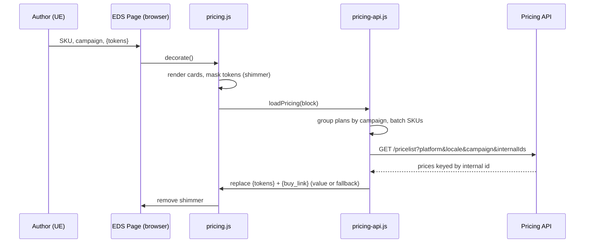
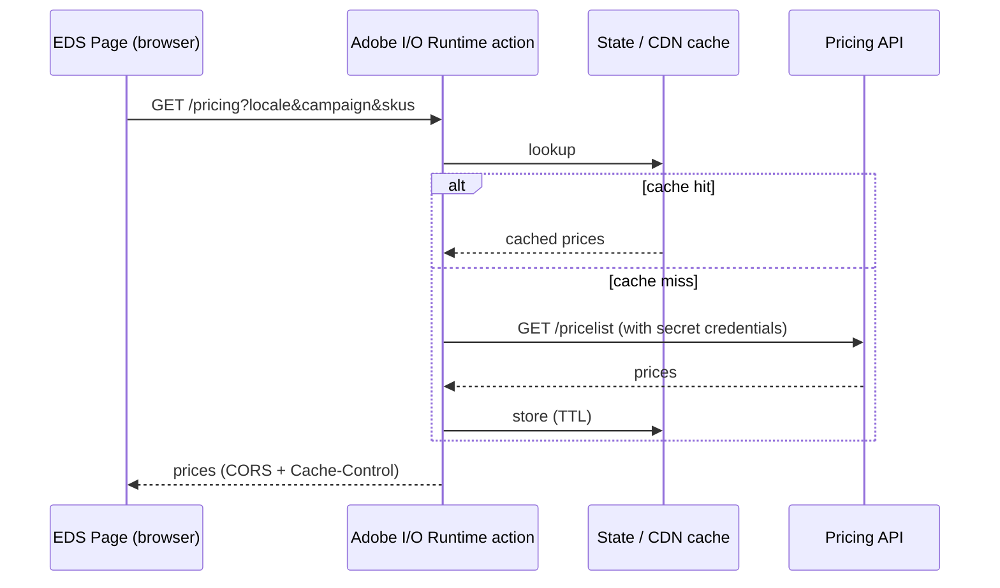
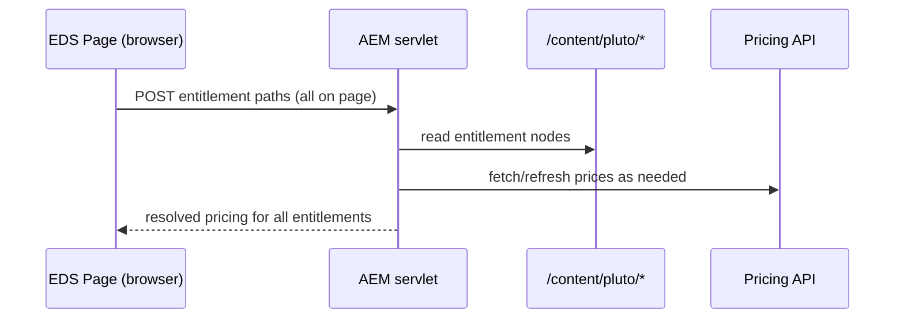

# Pricing Plan price fetching — current approach and alternatives

This document describes how the Pricing block currently resolves live prices, and
records alternative architectures for fetching the same data. It is a decision
aid: the current approach is what ships today; the alternatives are options to
consider as requirements around caching, security, and authoring evolve.

- [Current approach — direct client-side pricing API call](#current-approach--direct-client-side-pricing-api-call)
- [Alternative 1 — Adobe I/O endpoint as a caching + security layer](#alternative-1--adobe-io-endpoint-as-a-caching--security-layer)
- [Alternative 2 — Pluto entitlement paths via an AEM servlet](#alternative-2--pluto-entitlement-paths-via-an-aem-servlet)
- [Alternative 3 — Content Fragment + GraphQL approaches](#alternative-3--content-fragment--graphql-approaches)
  - [3.1 — Author SKU + campaign on the Content Fragment](#31--author-sku--campaign-on-the-content-fragment)
  - [3.2 — Author entitlement paths on the block](#32--author-entitlement-paths-on-the-block)
- [Comparison](#comparison)

---

## Current approach — direct client-side pricing API call

Today the browser calls the pricing API directly from the Pricing block and
swaps placeholder tokens for the live values in place.

### How it works

1. **Authoring.** Each Pricing Plan item is authored with discrete fields. Price
   and discount fields hold placeholder tokens (`{strike_price}`, `{sale_price}`,
   `{monthly_price}`, `{monthly_strike}`, `{future_price}`, `{future_strike}`,
   `{discount}`), and the buy button href is always the `{buy_link}` token. Two
   hidden fields — **SKU** (the pricing API internal id) and **Campaign Code** —
   drive the lookup.
2. **Decoration.** `blocks/pricing/pricing.js` renders each plan card, stamps
   `data-sku` / `data-campaign` on `.pricing-plan`, and tags any token-bearing
   element with `pricing-has-token`. It then adds an `is-loading` shimmer and
   calls `loadPricing(block)` during the lazy phase (not delayed), so raw tokens
   are masked until they resolve.
3. **Fetch + resolve.** `scripts/pricing-api.js` groups plans by campaign, issues
   **one request per campaign** (all SKUs batched via `internalIds`), and resolves
   every known token in each plan's text nodes plus the `{buy_link}` href.
4. **Always-resolve + fallback.** Every token is always replaced — with the API
   value when present, otherwise a fallback (`X.XX` for prices, `#` for the buy
   link) — so a raw `{token}` is never left visible even if the API is
   unreachable.
5. **De-duplication.** `fetchPricelist` caches in-flight/resolved promises by
   request URL, so identical campaign+locale+SKU requests hit the network once.
6. **Config.** The endpoint, platform, and default locale come from
   `scripts/env.js` (a per-environment JS config module — see caveats below).

### Data flow



### Key files

| File | Role |
| --- | --- |
| `blocks/pricing/_pricing.json` | UE model — discrete fields incl. hidden SKU / Campaign Code |
| `blocks/pricing/pricing.js` | Renders cards, stamps `data-sku`/`data-campaign`, triggers fetch |
| `blocks/pricing/pricing.css` | `is-loading` shimmer that masks `pricing-has-token` elements |
| `scripts/pricing-api.js` | Fetch, batch, token/`{buy_link}` resolution, fallback, de-dup |
| `scripts/env.js` | Endpoint / platform / default-locale config, per environment |

### Token → API field mapping

| Token | API field |
| --- | --- |
| `{strike_price}` | `priceFormatted` |
| `{sale_price}` | `realPriceFormatted` |
| `{monthly_price}` | `realPriceRoundedPerMonthFormatted` |
| `{monthly_strike}` | `priceRoundedPerMonthFormatted` |
| `{future_price}` | `futureRealPriceFormatted` |
| `{future_strike}` | `futurePriceFormatted` |
| `{discount}` | `discountPercentFormatted` → `discountFormatted` |
| `{buy_link}` | `link` |

### Pros

- Simplest possible architecture — no extra services, no build step.
- Always current: prices reflect the live API on every page load.
- Batched + de-duplicated: one request per campaign per page.

### Cons / caveats

- **Endpoint is public.** The API base ships to the browser. It must be a
  publicly reachable, non-secret endpoint. The current
  `pricing-api.svc.int.avast.com` host is internal, so this only works where the
  browser can reach it (e.g. corporate network) — a strong signal that a proxy
  (Alternative 1) or a server-side pre-fetch is needed for public traffic.
- **No caching layer.** Every visitor hits the pricing API directly; no CDN or
  dispatcher caching in front.
- **No secrets possible.** Any auth on the API cannot be enforced client-side.
- **CORS.** The API must send CORS headers allowing the site origin.

---

## Alternative 1 — Adobe I/O endpoint as a caching + security layer

Instead of the browser calling the pricing API directly, put an **Adobe I/O
Runtime** action (App Builder) in front of it. The browser calls the I/O
endpoint; the action calls the pricing API server-side, caches the response, and
returns clean JSON.



**What changes in this repo:** `scripts/env.js` points `pricingApiBase` at the
I/O endpoint instead of the raw pricing API. `pricing-api.js` is largely
unchanged — it just talks to the proxy.

### Pros

- **Security.** API credentials/keys live in the action's environment
  (I/O Console inputs / `.env`), never in the browser.
- **Caching.** The action can cache in I/O State or via `Cache-Control` at the
  CDN, since prices change infrequently — big reduction in upstream calls.
- **Reachability.** The action (not the browser) reaches the internal API, so
  this works for public traffic even though the origin is internal.
- **Shaping.** Response can be trimmed to only the fields the block needs.

### Cons

- Extra service to build, deploy, and operate (App Builder project + CI).
- Cache invalidation policy needed for campaign/price changes.
- Still a live per-request path (albeit cached), vs. pre-published JSON.

---

## Alternative 2 — Pluto entitlement paths via an AEM servlet

Reuse the traditional AEM/pluto model. Entitlement content lives under
`/content/pluto/...` paths in AEM. The pricing details for **all entitlements on
the page** are passed to an **AEM servlet**, which returns the resolved response.



**What changes:** plans are authored with (or mapped to) pluto entitlement
paths; the block collects them and calls the servlet once; `pricing-api.js` is
replaced by a servlet client.

### Pros

- **Reuses existing pluto pricing pipeline** and its centralized authoring —
  price/campaign updates happen in one place, as they do today in classic AEM.
- Server-side, so credentials and internal endpoints stay private.
- One round trip for all entitlements on the page.

### Cons

- Couples EDS delivery to an AEM instance/servlet — adds a backend dependency
  and a non-EDS runtime to the request path.
- Servlet latency/availability is now in the page's critical path unless cached
  at dispatcher/CDN.
- More infrastructure to maintain than a pure EDS approach.

---

## Alternative 3 — Content Fragment + GraphQL approaches

Model entitlements as **Content Fragments** in AEM and read them with AEM
**GraphQL persisted queries**, cached at the dispatcher and CDN. Because prices
change infrequently, persisted-query caching gives near-static performance while
keeping a single authoring source.

### 3.1 — Author SKU + campaign on the Content Fragment

SKU and campaign code are authored **on the Content Fragments**. A persisted
query fetches entitlements by **SKU + locale** in a single call, and the client
filters the result to the campaign it needs.

**Query — `getEntitlementsBySkuAndLocale`:**

```graphql
query getEntitlementsBySkuAndLocale($skusExpression: [StringFilterExpression]!, $locale: String) {
  entitlementList(filter: {
    sku: {
      _logOp: OR,
      _expressions: $skusExpression
    },
    locale: {
      _expressions: { value: $locale }
    }
  }) {
    items {
      sku
      campaign
      strikePrice
      salePrice
      monthlyStrikePrice
      monthlySalePrice
      futureStrikePrice
      futureSalePrice
      buyLink
      discount
      locale
    }
  }
}
```

**Variables:**

```json
{
  "skusExpression": [
    { "value": "SPM-00-001-12" },
    { "value": "PRW-00-001-12" },
    { "value": "PRD-00-001-12" },
    { "value": "AUM-00-001-12" }
  ],
  "locale": "en-ww"
}
```

The block collects the SKUs of all plans on the page, issues **one** persisted
query with the locale, then filters the returned items by the plan's campaign.

**Pros**

- **One GraphQL call** returns pricing for all product SKUs on the page.
- Persisted query → cacheable at dispatcher + CDN; excellent performance for
  infrequently changing prices.
- No live external pricing API in the request path.

**Cons**

- **No centralized authoring.** SKU and campaign are set at the page/block level,
  so a campaign change means updating every page that references it.
- Client must post-filter by campaign after the query returns.

### 3.2 — Author entitlement paths on the block

Instead of passing SKU + campaign, authors configure **entitlement Content
Fragment paths** on the block in the UE editor. Those paths are sent to a
persisted query that filters entitlements by `_path`.

**Query — `getEntitlementsByPaths`:**

```graphql
query getEntitlementsByPaths($pathsExpression: [IDFilterExpression]!) {
  entitlementList(filter: {
    _path: {
      _logOp: OR,
      _expressions: $pathsExpression
    }
  }) {
    items {
      sku
      campaign
      strikePrice
      salePrice
      monthlyStrikePrice
      monthlySalePrice
      futureStrikePrice
      futureSalePrice
      buyLink
    }
  }
}
```

**Variables:**

```json
{
  "pathsExpression": [
    { "value": "/content/dam/avast/entitlements/ww/en/premium-security/1-mac" },
    { "value": "/content/dam/avast/entitlements/ww/en/premium-security/1-windows-pc" },
    { "value": "/content/dam/avast/entitlements/ww/en/premium-security/10-devices" },
    { "value": "/content/dam/avast/entitlements/ww/en/ultimate/1-mac" }
  ]
}
```

**Pros**

- **Centralized authoring.** SKU and campaign are authored only on the Content
  Fragments, not on the page. Updating a fragment updates pricing everywhere it
  is referenced — no per-page edits when a campaign changes.
- Same caching benefits as 3.1 (persisted query, dispatcher + CDN).
- One GraphQL call for all entitlements on the page.

**Cons**

- Authors must know/choose the correct entitlement fragment paths per plan.
- Requires the entitlement Content Fragment model and a sync process that keeps
  fragment prices current (e.g. a job that refreshes fragments from the pricing
  API).
- Still depends on an AEM GraphQL endpoint being reachable/cached.

---

## Comparison

| Approach | Auth/secrets | Caching | Authoring source | Calls per page | AEM dependency |
| --- | --- | --- | --- | --- | --- |
| **Current** — direct client call | None (public endpoint only) | None | Page (SKU + campaign) | 1 per campaign | No |
| **1** — Adobe I/O proxy | Yes (server-side) | I/O State / CDN | Page (SKU + campaign) | 1 per campaign (cached) | No |
| **2** — Pluto servlet | Yes (server-side) | Dispatcher/CDN (optional) | Centralized (pluto) | 1 (all entitlements) | Yes |
| **3.1** — CF + GraphQL (SKU) | Yes (server-side) | Persisted query + CDN | Page (on CF, but referenced per page) | 1 (all SKUs) | Yes |
| **3.2** — CF + GraphQL (paths) | Yes (server-side) | Persisted query + CDN | Centralized (Content Fragments) | 1 (all paths) | Yes |

**Rules of thumb**

- Need it working now, public endpoint available, freshness matters most →
  **Current**.
- Need caching + credential security without changing the authoring model →
  **Alternative 1**.
- Want to reuse the existing pluto pricing pipeline and its central authoring →
  **Alternative 2**.
- Want CDN-cached GraphQL with a single call for all products →
  **Alternative 3**; pick **3.2** for centralized authoring, **3.1** if
  page-level SKU/campaign is acceptable.
